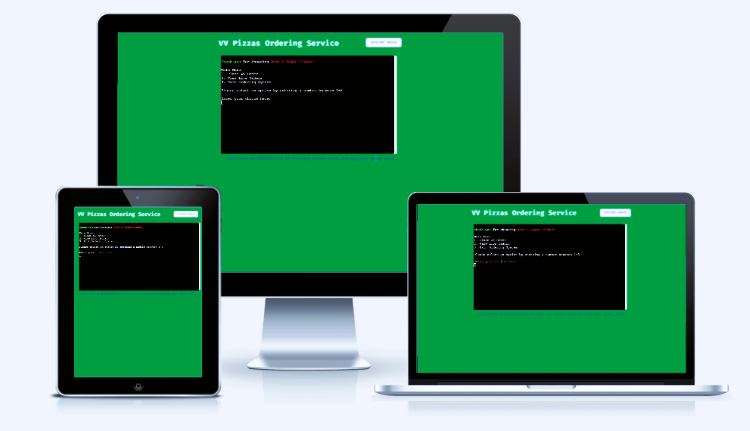
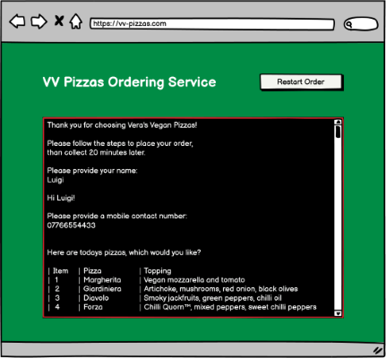
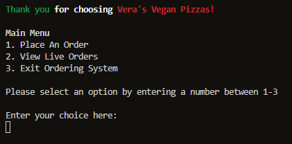
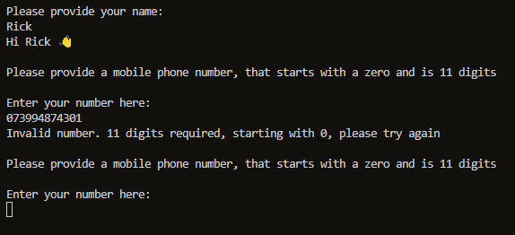

# VV Pizzas

<p align="center">
  
</p>

[Link to Website](https://vv-pizzas.herokuapp.com/)

[GitHub Repo](https://github.com/RickofManc/vv-pizzas)


***

## About

Vera's Vegan Pizzas is a popular South Manchester based food truck. The popularity of this delicious "can't believe it's vegan" pizza often leads to long wait times to order. Whilst most customers are happy to wait, Vera feels she is losing customers before they order due to an absence of online ordering. Currently, there is a single point of contact to place orders via phone, and if this is frequently engaged, some customers order elsewhere.  


***


## Index - Table of Contents

* [User Experience R&D](#user-experience-research-and-design)
    * [Strategy](#Strategy)
    * [Scope](#Scope)
    * [Structure](Structure)
    * [Skeleton](#Skeleton)
    * [Surface](#Surface)
* [Features](#Features)
* [Data Model](#Data-Model)
* [Testing](#Testing)
* [Deployment](#Deployment)
* [Credits](#Credit)


***


## User Experience Research and Design


### Strategy

Vera requires a solution that provides a new method for customers to place orders. An online based ordering system should be simple, and clear in design and layout,  taking a similar duration to ordering by phone. 

A successful solution should reduce the amount of calls Vera is handling to allow her to focus on cooking.
Furthermore, as the orders will be received digitally to a Google based spreadsheet, Vera will be able to execute them in order from viewing the spreadsheet on screen.

There are additional benefits of moving to a digitally driven ordering system; in that Vera will have order data and her fingertips. Allowing Vera to analyse and forecast stock levels for a particular day and/or location far easier than the current paper based method. Vera will also be able to make changes to the menu and costs within the spreadsheet negating the requirement for Developer services to update within the code.


#### Leading User Stories

* As a customer... 
    * I want to place an order at the first time of trying, so that I don't have to keep calling back.
    * I want to understand how long it will take to cook my order, so that I can plan my journey time.
    * I want to learn which pizzas are available, so I can choose my preferred option.
    * I want to learn which sizes are available, so I can choose the appropriate size for my appetite.
    * I want to order multiple pizzas, so I can more food to more people.
    * I want to be able to amend the order before committing, so that if a mistake is made I don't have to restart the order.
* As the owner... 
    * I want to reduce the time spent on the phone and writing orders, so I can focus on executing the orders.
    * I want to provide an easier method of ordering pizza, so that our orders increase.
    * I want to be able to inform customers of changes to the menu daily, so I can try new toppings and improve customer satisfaction.
    * I want to have data from the days orders, so that I can learn of customers trends and forecast more accurately.


#### Primary strategic aims for the website
* The application will provide a method of receiving and executing orders from Vera's customers.
* The application will be intuitive for the customer to follow, and take a similar amount of time as if ordering by phone.
* Customers who had previously ordered elsewhere due a continually engaged phone line, will place an order online, which in turn will increase revenue.


The roadmap below highlights the high-level strategic opportunities versus the importance and viability/feasibility of development for the MVP (Minimal Viable Product):

<p align="center">
  
</p>


### Scope

An agile approach of keeping the in scope features simple and aligned to the strategy for the MVP will be adopted.
Below is a list of the leading features for the application.

#### In Scope Features
* Create an online interface for customers to place orders.
* A welcome message.
* Options for ordering different pizza sizes.
* Options for ordering different pizza toppings.
* On screen confirmation of the order before placing with Vera.
* Provide the order details in a spreadsheet to Vera as they are received.
* Provide the customer with a cost to be paid on collection.
* Add the value of each order within the spreadsheet.

#### Out of Scope Features (for a future release)
* Develop application for smartphones. 
* Options for ordering custom toppings.
* Email confirmation when the order is placed.
* Provide the customer with the opportunity to pay online.
* Provide the customer with an expected wait time dependent on current live orders.


### Structure

This website will be structured with the following design considerations;
* The customer will be welcomed to the CLI (Command Line Interface) with a welcome message from Vera.
* The customer will be asked for basic details, including their name which could be used as the order reference for the MVP.
* The customer will then be asked which pizza they would like from the menu.
* This will be followed by the size of pizza they would like; Small, Medium, Large
* Confirmation of their order will be provided, asking them whether they would like to place the order, or order anything else.
* If the customer needs to order more items they will be navigated back the first ordering question.
* If the customer has requested all items then the order will be placed and the Google Sheet updated for Vera.
* Finally the customer will be thanked and informed of the time for collection. customer.

The final structure may differ slightly as development progresses and from user feedback.


### Skeleton

Key to the UX attributes is the ease for which customers can place an order. Therefore the website will contain a simple interface that immediately welcomes the customers and takes them through the process with minimal inputs.

The journey should take a similar amount of time to when ordering by phone which should ensure no customers are lost with the change in method. 

Aesthetically the page will be clean with no images, and a clear header informing the user they are ordering with VV Pizzas. Use of the national colours of Italy will provide signals of the food theme. Within the interface, Emoji's will be used to communicate some fun. However, they will not be used to replace words to avoid any confusion with the customer.

Should the customer make an error whilst navigating through the system, a message will appear guiding them on the steps to take, whilst also having the ability to navigate to the Main Menu and exit the system. Furthermore, customers will have the ability to restart the order from within the interface or  by clicking a 'Restart Order' button located on the browser page.

#### Flowchart

A flowchart outlining the customer journey has been created using [Lucidchart](https://www.lucidchart.com/pages/). The final application may differ slightly as development progresses and from user feedback.

<p align="center">
    
</p>


#### Wireframe

As part of this phase a wireframe for a browser has been produced using [Balsamiq](https://balsamiq.com/wireframes/) (see image below - the wireframe is located within the project [Repo](https://github.com/RickofManc/vv-pizzas)).

The website is responsive through differing screen widths to a minimum of 800px wide. It is not yet developed for smartphones - a future sprint should see this delivered. 

<p align="center">
    
</p>


### Surface 

The key aim for the MVP launch is to have a readable interface for the customer to order. With this in mind the surface theme has retained a simple amd clean style.


#### Colour 

The colour palette signals 'Italy' to the customer, to convey the link with the Italian food of pizza. The Savoy Azure Blue works well to provide some accents, however it does not work as well within the interface against the black background. Where as the Green and Red from the Italian flag are readable against the background. However, they have not been overly used to ensure all critical text is readable.

<p align="center">
    
</p>

#### Font

'Fira Code' font has been selected for free commercial use from Google Fonts due to it's similar style to the interface font. Fira Code is an extension of the Fira Mono font containing a set of ligatures for common programming multi-character combinations. Whilst these ligatures won't be used within this build, it does highlight the font is quick and easy to read.

<p align="center">
    
</p


***

## Features

### Current Features

* A welcome message greets the customer
<p align="center">
    
</p

* As the order process starts, the customer is ask for their name and mobile phone number
    * An error message will inform the customer if their entry is not in the correct format
<p align="center">
    
</p>


### Future Features

Following a successful MVP launch, the application has the opportunity to be further developed over a relatively short period to improve UX.
Here are a few of the immediate features that can be developed:
* Application works on smartphones.
* Website features i.e. About, Contact, Map, Social Media.
* Pay online prior to collection
* Real-time update on the order to customer via email/SMS.


### Meta data

Meta data has been included within the website HTML head element to increase the traffic to the website. Furthermore the site page has been titled appropriately as another method of informing users of their location.


***


## Data-Model 

I have based the model on functions used as the steps to request, validate and return data from the customer. These functions are called from within the 'Place Order' function. As each function is executed, the return values are collated and confirmed back to the user before the order is sent to kitchen. 

An external Google Sheet is used to receive this data in a format the kitchen can read, execute and update the order status. This Sheet is also used by the Owner to update the menu for the day, and any cost changes. Pandas has been incorporated to receive these tables of data into the source code as a DataFrame. The DataFrames are then formatted using Tabulate to display to the customer.

The Google Sheet can be viewed online at [VV Pizzas](https://docs.google.com/spreadsheets/d/1-0Hu5_4mXknpqb36h5K3NuboPPn9xHJsGvmpaZjTMtU/edit#gid=1680754323). Data within is for the purposes of the MVP and therefore fictitious.

***


## Testing 

Throughout the Build phase Python Tutor, PEP8 Online and Chrome Developer Tools are used to ensure all pages are being developed to remain intuitive, responsive and accessible across several screen widths. These tools and others were used for the Testing phase. Full details and results of this phase can be found within the project [Repo](https://github.com/RickofManc/vv-pizzas).

The following sections summarise the tests and results.


### Code 

The code on each file has been tested using the appropriate validation service; W3C Markup for HTML and PEP8 Online for Python.

Below are the summarised results from these tests:

* **run.py** - 0 Errors / 0 Warnings
* **layout.html** - 0 Errors / 0 Warnings
* **index.html** - 1 Errors / 2 Warnings; relating to the absence of boiler pate <!DOCTYPE HTML> which is to expected given the structure of the website and this being coded to the layout.html file.
* **404.html** - 0 Errors / 0 Warnings


### Browser


### Device


### Accessibility 

The homepage has been tested using the [Wave (Web Accessibility Evaluation Tool)](https://wave.webaim.org/) with zero alerts or errors received. 


### Performance 


### User Stories

The leading user stories have been tested to ensure the priority aims of the website have been delivered. Below is a summary of the stories validation.


### Issues

The issues listed in the table below we identified during March 2022.


## Deployment

This project was deployed using the steps below with version releasing active. Please do not make any changes to files within this repository as any changes pushed to the main branch will be automatically reflected on the live website. Instead please follow the steps below which guide you to forking the website where changes can be made without impact to the live website. Thanks!


### Fork and Deploy with Github

<details>
    <summary></summary>

To fork this website to either propose changes or to use as an idea for another website, follow these steps:
1. If you haven't yet, you should first set up Git. Don't forget to set up authentication to GitHub.com from Git as well
1. Navigate to the [VV Pizza](https://github.com/RickofManc/vv-pizzas).
1. Click the 'Fork' button on the upper right part fo the page. It's in between 'Watch' and 'Star'
1. You will now have a fork of the VV Pizzas repository added to your GitHub profile. Navigate to your own profile and find the forked repository to add the required files.
1. Above the list of forked files click the 'Code' button
1. A drop-down menu will appear providing a choice of cloning options. Select the one which is applicable to your setup
Further details on completing the final step can be found on GitHub's [Fork a Repo](https://docs.github.com/en/get-started/quickstart/fork-a-repo) page

To deploy from Github follow this steps:
1. Log into your Github repository, create a Github account if necessary
1. Click 'Settings' in the main Repository menu
1. Click 'Pages' from the left hand side navigation menu
1. Within the Source section, click the "Branch" button and change from 'None' to 'Main'
1. The page should automatically refresh with a url displayed
1. Test the link by clicking on the url

The url for this website can be found here https://vv-pizzas.herokuapp.com/

</details>

### Create data model and integrate using an API

<details>
    <summary></summary>

Create a Spreadsheet (Data Model)
1. Login to your Google account, create an account if necessary
1. Navigate to Sheets, Googles version of Microsoft Excel
1. Start a new spreadsheet, amend the title at the top i.e. VV Pizzas
1. Create 3 Sheets/Tabs, titling 'Orders' 'Pizzas and 'Sizes'
1. In the first row of the Orders sheet, add the following column headers;
    * Name, TelNum, Pizza, Size, Quantity, Cost, Time, Date, Status 
1. In the first row of the Pizza sheet, add the following column headers;
    * Item, Pizza, Topping
1. In the first row of the Sizes sheet, add the following column headers;
    * Item, Name, Size, Cost


Setup API
1. Navigate to [Google Cloud Platform](https://cloud.google.com/gcp?utm_source=google&utm_medium=cpc&utm_campaign=emea-gb-all-en-bkws-all-all-trial-e-gcp-1011340&utm_content=text-ad-none-any-DEV_c-CRE_500227884420-ADGP_Hybrid%20%7C%20BKWS%20-%20EXA%20%7C%20Txt%20~%20GCP%20~%20General%23v1-KWID_43700060384861702-kwd-26415313501-userloc_9041106&utm_term=KW_google%20cloud%20platform-NET_g-PLAC_&gclid=CjwKCAiAvaGRBhBlEiwAiY-yMH6ZzZToth-9fTjp0B_qAE91ulGwN7jIb0KBGW5TbmN8Z5w9JE1noRoCSmIQAvD_BwE&gclsrc=aw.ds)
1. If you do not already have a profile then follow the basic steps for creating an Account, via clicking on the 'Get Started for Free' button in the upper right corner
1. Once the previous step is complete, create a new project with a unique title
1. You should now arrive at the project dashboard and be ready to setup the required credentials;
    * Access the navigation menu from clicking on the hamburger button
    * Select APIs and Services, followed by 'Library'
    * Search for and select Google Drive API -> Enable
    * Search for and select Google Sheets API -> Enable
    * Click Enable to navigate to 'API and Services Overview' 
    * Click Create Credentials in the upper left of the screen
    * For Credential Type, select 'Google Drive' from the dropdown
    * For 'What data will you be accessing' select Application Data
    * For 'Are you planning to use this API with Compute Engine...?' choose 'No, I'm not...'
    * Click Next
    * Within the Create Service Account page, enter a Service Account Name
    * Click Create and Continue
    * Next within 'Grant this service account access to project', choose Basic -> Editor from the 'Select a Role' dropdown
    * Click Continue
    * Next within 'Grant users access to this service account', choose 'Done'
    * On the following, click on the 'Service Account Name' you created to navigate to the config page
    * Navigate to the Keys section
    * Select 'Add Key' dropdown -> Create New Key.
    * Select 'JSON' -> Create - the file will download to your machine
    * From your local downloads folder, add file directly to your Gitpod workspace, and rename the file to creds.json
    * Within the file, copy the value for 'client email'. Paste this email address into the 'Share' area of your Google Sheet, assigning the role of Editor

Enable API within IDE
1. From within your Gitpod IDE terminal, enter 'pip3 install gspread google-auth'
1. At the top of your Python file add the following lines:

    ```
    import gspread
    from google.oauth2.service_account import Credentials
    ```
    
1. Below this add the following code:

    ```
        SCOPE = [
            "https://www.googleapis.com/auth/spreadsheets",
            "https://www.googleapis.com/auth/drive.file",
            "https://www.googleapis.com/auth/drive"
            ]

        CREDS = Credentials.from_service_account_file('creds.json')
        SCOPED_CREDS = CREDS.with_scopes(SCOPE)
        GSPREAD_CLIENT = gspread.authorize(SCOPED_CREDS)
        SHEET = GSPREAD_CLIENT.open('vv_pizzas')
        console = Console()
        install(show_locals=True)
    ```
</details>


### Deploy with Heroku
<details>
    <summary></summary>

* The requirements.txt file in the IDE must be updated to package all dependencies. To do this;
    1. Enter the following into the terminal: 'pip3 freeze > requirements.txt'
    1. Commit the changes and push to Github

* Next, follow the steps below;
    1. Login to [Heroku](https://heroku.com/), create an account if necessary
    1. Once at your Dashboard, click 'Create New App'
    1. Enter a name for your application, this must be unique, and select a region
    1. Click 'Create App'
    1. At the Application Configuration page, apply the following to the Settings and Deploy sections:
        * Within 'Settings', scroll down to the Config Vars section to apply the credentials being used by the application. In the Reveal Config Vars enter 'CREDS' for the Key field, and paste the all the contents from the creds.json file into the Value field
        * Click 'Add'
        * Add another Config Var with the Key of 'PORT' and the Value of '8000'
        * Within Settings, scroll down to the Buildpacks sections, click to Add a Buildpack
        * Select Python from the pop-up window and Save
        * Add the Node.js Buildpack using the same method
        * Navigate to the Deploy section, select Github as the deployment method, and connect to Github when prompted
        * Use your the Github repository name created for this project
        * Finally, scroll down to and select to deploy 'Automatically' as this will ensure each time you push code in Github, the pages through Heroku are updated
    1. Your application can be run from the Application Configuration section, click 'Open App'

</details>

    

***


## Credit

### People

* Mentor Brian Macharia for guiding and advising throughout the projects lifecycle on how to improve UX and my code.

Support with how to develop ideas into code also came from numerous online resources:

* [Validating Mobile Phone Number Format](https://stackoverflow.com/questions/16135069/how-do-i-validate-a-mobile-number-using-python)
* [Converting String Inputs to Integers](https://stackoverflow.com/questions/13207697/how-to-remove-square-brackets-from-list-in-python)
* [Applying Date and Time to Orders](https://www.programiz.com/python-programming/datetime/current-datetime)
* [Clearing Screen Between Menus](https://www.geeksforgeeks.org/clear-screen-python/)
* [Adding Time Delay to Function Calls](https://www.pythoncentral.io/pythons-time-sleep-pause-wait-sleep-stop-your-code/)
* [Visualising a Progress Bar](https://www.freecodecamp.org/news/use-the-rich-library-in-python/)
* [Providing System Exit Method](https://stackoverflow.com/questions/543309/programmatically-stop-execution-of-python-script)


### Python Library Dependencies and Packages

* [Google Sheet](https://docs.google.com/spreadsheets/d/1-0Hu5_4mXknpqb36h5K3NuboPPn9xHJsGvmpaZjTMtU/edit#gid=1680754323) to display the orders for the kitchen, and to allow the Owner to update the menu and cost.
* [Rich Console](https://rich.readthedocs.io/en/stable/console.html) to style terminal text, provide a Progress Bar when sending orders, and as formatted traceback for development.
* [Pandas](https://pandas.pydata.org/) to receive data from the external Google Sheet into a DataFrame.
* [Tabulate](https://pypi.org/project/tabulate/) to render pandas DataFrames.
* [Regular Expression (or RE)](https://docs.python.org/3/library/re.html) to validate the customers mobile number structure
* [Datetime](https://docs.python.org/3/library/datetime.html) to add the date and time to the order before sending to the kitchen.
* [Time](https://docs.python.org/3/library/time.html) in conjunction with [Sleep](https://realpython.com/python-sleep/) to delay functions executing which for the customer provides time to read messages before moving to the next screen. 


### Software & Web Applications

* [Balsamiq](https://balsamiq.com/) - Used to build wireframes in the Skelton phase. 
* This website was coded using Python3, HTML5, CCS3 and JavScript with [GitPod](https://gitpod.io/) used for an IDE and [GitHub](https://github.com/) as a hosting repository.
* [W3schools](https://www.w3schools.com/) - Source of 'How to...' information throughout the build.
* [Stack Overflow](https://stackoverflow.com/) - Source of 'How to...' information on Python code.
* [Python Tutor](https://pythontutor.com/) - For testing sections of code.
* [Wave](https://wave.webaim.org/) - Accessibility Testing to ensure content is readable for all users.
* [HTML Validator](https://validator.w3.org/) - For validating HMTL code.
* [PEP8 Validator](http://pep8online.com/)  - For validating Python code.
* [Code Beautify](https://codebeautify.org/) - For validating the layout of all code.
* [IE NetREnderer](https://netrenderer.com/index.php) - For testing website functionality on IE versions 7-10.
* [LambdaTest](https://www.lambdatest.com/) - For cross browser testing on macOS versions of Safari and Opera.